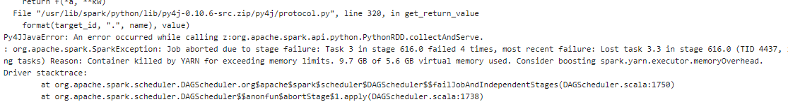

# spark-higgs

This repository details how to use [Spark](https://spark.apache.org/) and [Amazon Web Services](https://aws.amazon.com/) to analyze the [HIGGS data set from UCI](https://archive.ics.uci.edu/ml/datasets/HIGGS).
This dataset is used as a benchmark to test Machine Learning algorithms performance on the task of
identifying nuclear collisions that produce the HIGGS boson versus background process.

# Data

The data set consists of 11 Million Monte Carlo simulations of nuclear collisions. Signal collisions correspond to collisions where a Higgs boson was created. Background collisions correspond to collisions that have the same end product particles but where a Higgs boson was not created. Each collision has 28 attributes. Data set location: [https://archive.ics.uci.edu/ml/datasets/HIGGS]

Relevant Paper: Baldi, P., P. Sadowski, and D. Whiteson. “Searching for Exotic Particles in High-energy Physics with Deep Learning.” Nature Communications 5 (July 2, 2014)

# Local Analysis

We start by utilizing a sub sample of the full dataset to test our pyspark code locally before we deploy to the AWS EMR cluster we will launch to analyze bigger chunks of data.  

```python
import pyspark
import os

#craete spark session
from pyspark.sql import SparkSession
spark = SparkSession.builder.appName('higgs-analysis').getOrCreate()

#read dataset from local filesystem
data_location = os.path.join('resources','HIGGS_subsampled_20k.csv')
df = spark.read.load(data_location, format="csv", sep=",", inferSchema="true", header="true")
df..headhead((22))
```

[Row(label=1.0,  lepton pT=0.869293212890625,  lepton eta=-0.6350818276405334,  lepton phi=0.22569026052951813,  missing energy magnitude=0.327470064163208,  missing energy phi=-0.6899932026863098,  jet 1 pt=0.7542022466659546,  jet 1 eta=-0.24857313930988312,  jet 1 phi=-1.0920639038085938,  jet 1 b-tag=0.0,  jet 2 pt=1.3749921321868896,  jet 2 eta=-0.6536741852760315,  jet 2 phi=0.9303491115570068,  jet 2 b-tag=1.1074360609054565,  jet 3 pt=1.138904333114624,  jet 3 eta=-1.5781983137130737,  jet 3 phi=-1.046985387802124,  jet 3 b-tag=0.0,  jet 4 pt=0.657929539680481,  jet 4 eta=-0.010454569943249226,  jet 4 phi=-0.0457671694457531,  jet 4 b-tag=3.101961374282837,  m_jj=1.353760004043579,  m_jjj=0.9795631170272827,  m_lv=0.978076159954071,  m_jlv=0.9200048446655273,  m_bb=0.7216574549674988,  m_wbb=0.9887509346008301,  m_wwbb=0.8766783475875854),
 Row(label=1.0,  lepton pT=0.9075421094894409,  lepton eta=0.3291472792625427,  lepton phi=0.3594118654727936,  missing energy magnitude=1.4979698657989502,  missing energy phi=-0.3130095303058624,  jet 1 pt=1.09553062915802,  jet 1 eta=-0.5575249195098877,  jet 1 phi=-1.588229775428772,  jet 1 b-tag=2.1730761528015137,  jet 2 pt=0.8125811815261841,  jet 2 eta=-0.2136419266462326,  jet 2 phi=1.2710145711898804,  jet 2 b-tag=2.214872121810913,  jet 3 pt=0.4999939501285553,  jet 3 eta=-1.2614318132400513,  jet 3 phi=0.7321561574935913,  jet 3 b-tag=0.0,  jet 4 pt=0.39870089292526245,  jet 4 eta=-1.138930082321167,  jet 4 phi=-0.0008191101951524615,  jet 4 b-tag=0.0,  m_jj=0.3022198975086212,  m_jjj=0.8330481648445129,  m_lv=0.9856996536254883,  m_jlv=0.9780983924865723,  m_bb=0.7797321677207947,  m_wbb=0.9923557639122009,  m_wwbb=0.7983425855636597)]

```python
#Train/Test split to validate our algorithms
(training, test) = df.randomSplit([0.7, 0.3])
training.count(), test.count()
```
(13998, 6002)

We need to convert our dataframe data to have a 'label' columns and 'features' columns made of DenseVector objects. That way we can map the (float, DenseVector) objects into LabeledPoint objects which are required
for the [MLlib](https://spark.apache.org/mllib/) **Gradient Boosted Trees** and **Random Forest** classifiers.

```python
fromfrom  pyspark.sql.functionspyspark  import *
from pyspark.ml.linalg import DenseVector

training_densetrainin  = training.rdd.map(lambda x: (x[0], DenseVector(x[1:])))
training_dense = spark.createDataFrame(training_dense, ["label", "features"])

test_dense = test.rdd.map(lambda x: (x[0], DenseVector(x[1:])))
test_dense = spark.createDataFrame(test_dense, ["label", "features"])
```

Create GBT model, train it on train data and get the model's error on test dataset

```python
from pyspark.mllib.tree import GradientBoostedTrees, GradientBoostedTreesModel
from pyspark.mllib.regression import LabeledPoint
from pyspark.mllib import linalg as mllib_linalg
from pyspark.ml import linalg as ml_linalg


def as_old(v):
    if isinstance(v, ml_linalg.SparseVector):
        return mllib_linalg.SparseVector(v.size, v.indices, v.values)
    if isinstance(v, ml_linalg.DenseVector):
        return mllib_linalg.DenseVector(v.values)
    raise ValueError("Unsupported type {0}".format(type(v)))

labelPoint_train = training_dense.rdd.map(lambda row: LabeledPoint(row.label, as_old(row.features)))
labelPoint_train.take(2)
```
[LabeledPoint(0.0, [0.2757946848869324,-2.107722520828247,1.6888595819473267,1.908488154411316,0.5887398719787598,1.263171911239624,1.3635212182998657,-1.162469506263733,0.0,0.5700910091400146,0.6751649379730225,-0.7686452865600586,0.0,1.0070127248764038,1.523929238319397,1.527646541595459,0.0,2.2059988975524902,-0.4685073494911194,0.2761847674846649,3.101961374282837,0.886506974697113,0.7055552005767822,0.9947258234024048,0.7694635391235352,0.5958611369132996,1.1519246101379395,1.440234661102295]),
LabeledPoint(0.0, [0.276892751455307,1.1248798370361328,-0.6266821026802063,1.1237695217132568,-1.6664758920669556,0.5972790122032166,-0.43671685457229614,-0.06258609890937805,0.0,0.5557380318641663,-1.2695250511169434,-0.7791869640350342,2.214872121810913,1.3078521490097046,-0.29747843742370605,1.0106332302093506,2.548224449157715,0.40089157223701477,-1.610308051109314,-0.39203202724456787,0.0,0.6491283178329468,0.8770354986190796,0.988837718963623,0.733756959438324,1.0162041187286377,0.6880929470062256,0.6694104671478271])]

```python
import time
train_start = time.time()
GBTmodel = GradientBoostedTrees.trainClassifier(labelPoint_train,categoricalFeaturesInfo={}, numIterations=30)
train_end = time.time()
print(f'Time elapsed training model: {train_end - train_start} seconds')
```
Time elapsed training model: 20.253782272338867 seconds


Evaluate GBT
```python
predictions = GBTmodel.predict(test_dense.rdd.map(lambda x: x.features.values))
labelsAndPredictions = test_dense.rdd.map(lambda lp: lp.label).zip(predictions)


testErr = labelsAndPredictions.filter(
    lambda lp: lp[0] != lp[1]).count() / float(test_dense.rdd.count())
print('Test Error = ' + str(testErr))
```
Test Error = 0.303565478173942

Create RF model, train it on train data and get the model's error on test dataset

```python
from pyspark.mllib.tree import RandomForest, RandomForestModel

train_start = time.time()
RFmodel = RandomForest.trainClassifier(labelPoint_train,
                                     numClasses=2, categoricalFeaturesInfo={},
                                     numTrees=30, featureSubsetStrategy="auto",
                                     impurity='gini', maxDepth=4, maxBins=32)
train_end = time.time()
print(f'Time elapsed training model: {train_end - train_start} seconds')
```

Time elapsed training model: 7.364403009414673 seconds

```python

predictionspredicti  = RFmodel.predict(test_dense.rdd.map(lambda x: x.features.values))
labelsAndPredictions = test_dense.rdd.map(lambda lp: lp.label).zip(predictions)

testErr = labelsAndPredictions.filter(
    lambda lp: lp[0] != lp[1]).count() / float(test_dense.rdd.count())
print('Test Error = ' + str(testErr))
```
Test Error = 0.344218593802066


# Results for further analysis

* 20k simulations: (train/test split 0.7/0.3)

    * GBT error = 0.3072; GBT time = 40.44 secs

    * RF  error = 0.3271; RF  time = 14.75 secs

* 200k simulations: (train/test split 0.7/0.3)

    * GBT error = 0.3066; GBT time = 57.71 secs

    * RF  error = 0.3366; RF  time = 13.00 secs

* 2M simulations: (train/test split 0.7/0.3)

  **'Out of memory errors in spark logs' --> onto the AWS cluster!**

# Higgs boson classification on AWS using Zeppelin and SparkSession

## Step one: Load your data to s3


## Step two: Choose cluster configuration and create it.

Go to your AWS dashboard and search for EMR. Then click in Create Cluster to make your cluster selection.


I had issues running my analysis on 20k simulation when I selected a 3 node cluster (one master, two slaves) of the m1.medium instance. I tried increasing the number of slaves to 4 without success. I only manages to run my script when I created a new cluster using m4.xlarge instances that have more RAM



AWS has the option to launch a cluster with Spark, Hadoop and Zeppelin pre-installed. Note that the cluster will take some time (~minutes) to launch.

You can crate your cluster using the following configutaion.


This is the Final cluster summary.


The master node and each slave now have 16 GB of memory


The increased memory comes at a price


## Step three: Set security groups

The next step is to set some security groups that will allow us to access the master node via Zeppelin in our browser. This is the easiest way to access the cluster for fast prototyping.

Click on the Create Security Group button and add two rules one for SSH and one for TCP with port **8890**. We will use that port later to connect to the master node via Zeppelin.


## Step four: Connect to Zeppelin and run the Analysis

Now you can connect to the cluster by using your master node's DNS (get it form the cluster summary page) by adding a colon and the port 8890. Also, you can pretty much copy the code from your local jupyter notebook onto the Zeppelin notebook cells and run it cell by cell or all together. The only change you have to make is to get your data from s3 instead of a local path in your filesystem. In the example shown I analyzed the 2M simulations that I could not in my own PC.


Finally, here are the errors on the test data for the GBT and RF algorithms. Note that there is much work to do (get AUC metric instead of error, hyper parameter tuning, analyze the full 11 million collisions, check for over-fitting, etc.) but this tutorial serves the purpose to get you up and running on the an AWS cluster.


## Step five: TERMINATE YOUR Cluster

... unless you want to keep paying Amazon for a cluster you are not using. Click on the Terminate button after selecting your cluster.
